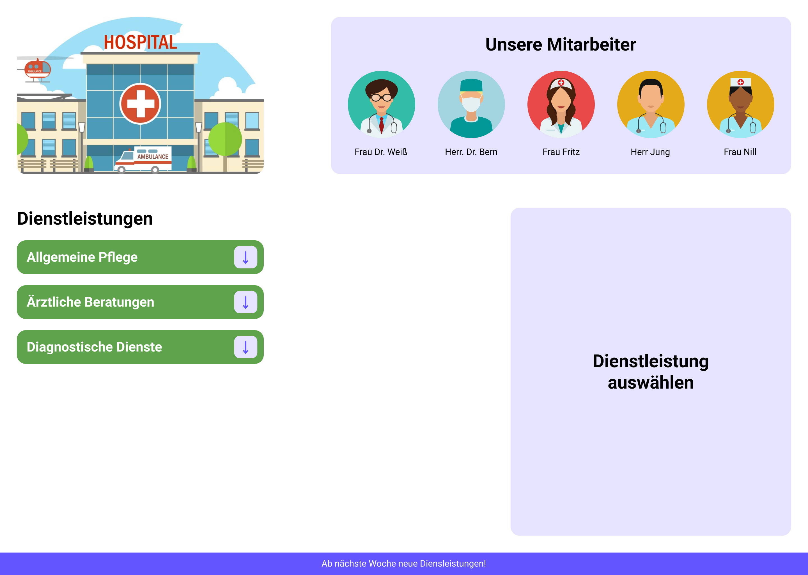
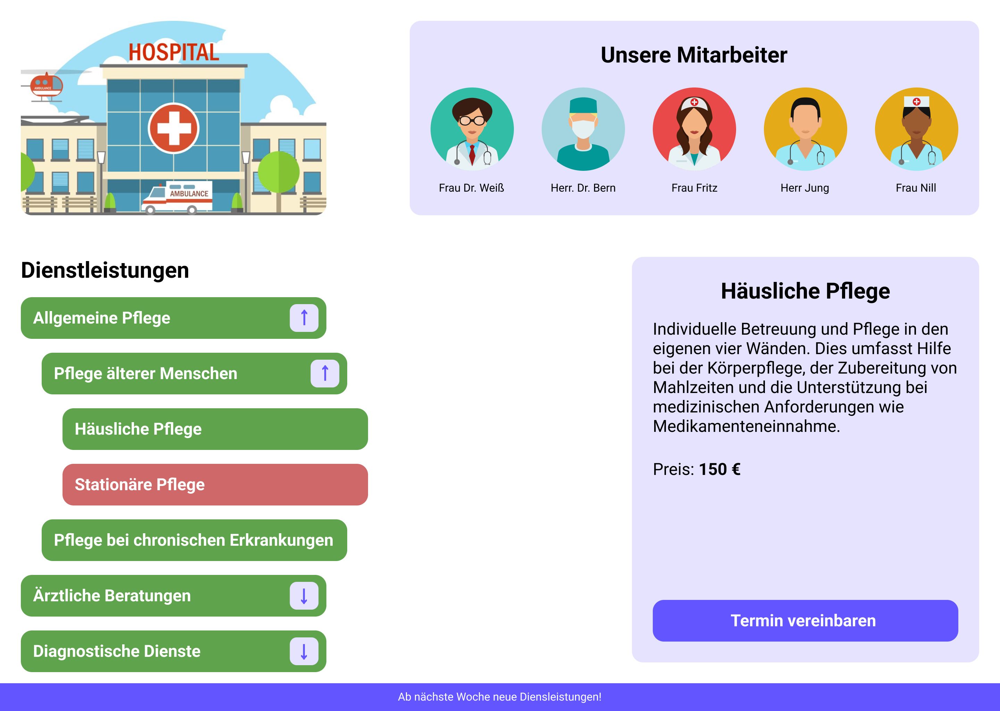
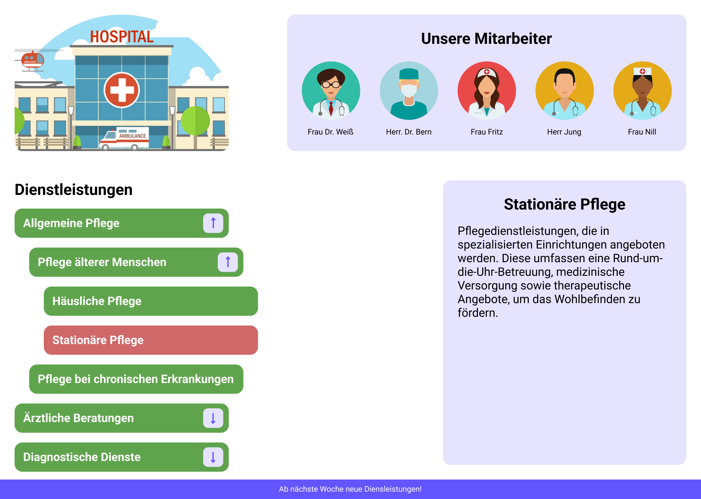
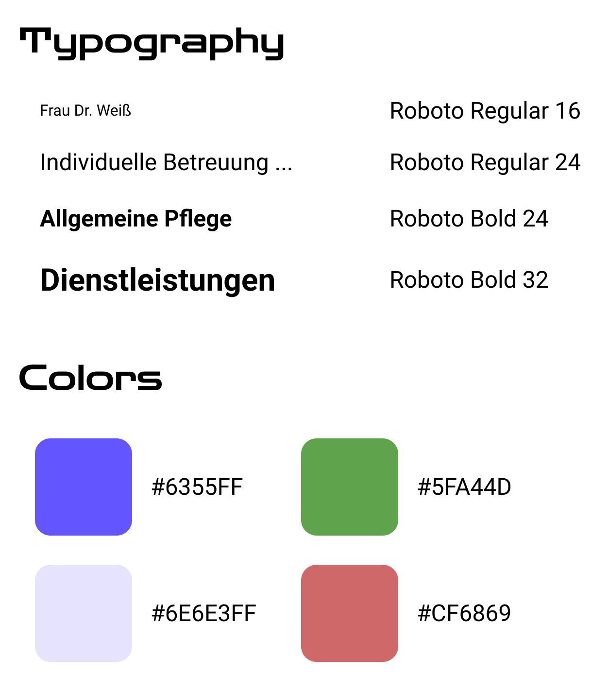

# Aufgabe

Entwicklung einer Single-Page-Anwendung (SPA) zur Darstellung und Verwaltung medizinischer Dienstleistungen.

Im oberen linken Bereich der Seite muss sich ein (abgeschnittenes) Logo befinden. Rechts davon sollen die Mitarbeiter der Organisation dargestellt werden.
Im Anhang der Aufgabe befindet sich eine .js-Datei mit Kategorien der von der Organisation angebotenen Dienstleistungen.

Diese Kategorien müssen als Liste dargestellt werden:
Alle Kategorien, die Unterkategorien haben, können durch einen Klick auf den Pfeil ein- oder ausgeklappt werden.
Wenn eine Kategorie keine Unterkategorie hat, wird kein Pfeil angezeigt.
Unterkategorien können ebenfalls eigene Unterkategorien besitzen.
Eine Kategorie hat einen grünen Hintergrund, wenn sie verfügbar ("available") ist, andernfalls einen roten Hintergrund.
Bei der Auswahl einer Kategorie (durch Klick darauf) sollen rechts die Details zu dieser Kategorie dargestellt werden.

Details zur ausgewählten Dienstleistung:
In einer Karte müssen der Name und die Beschreibung der "aktiven" Kategorie angezeigt werden.
Falls die Dienstleistung einen Preis hat, muss dieser ebenfalls angezeigt werden.
Wenn die Kategorie einen Preis hat und verfügbar ist, soll ein Button für die Terminvereinbarung angezeigt werden.
Beim Klick auf diesen Button soll die ID der Dienstleistung in der Konsole geloggt werden.

Optional:
Wenn zu viele Kategorien geöffnet sind und kein Platz für die gesamte Liste vorhanden ist, soll die Liste scrollbar sein.
Animationen können nach eigenem Geschmack implementiert werden. 😊

Der Quellcode soll in einem öffentlichen Repository gespeichert werden.
Teillösungen werden ebenfalls akzeptiert.

Viel Spaß bei der Umsetzung! 😊

    
    
    
    

